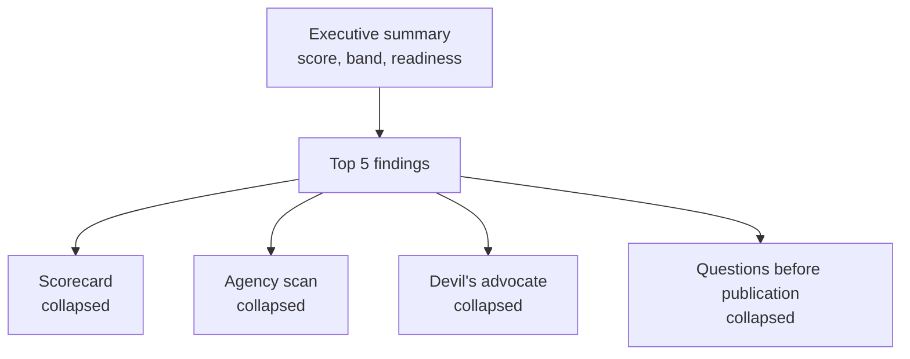

# Communications Trustability Review — Build Prompt v2

> **Revisions after testing (2026-09-19).** Four decisions from the owner's first round of testing amend this prompt and take precedence over any conflicting line below:
> 1. **Brevity.** The executive assessment is two sentences, at most 60 words. Every finding field is at most two sentences.
> 2. **Agency calibration.** An organization speaking in its own name ("COMPANY_NAME has decided") or as "we", or naming a body such as the executive team or the board, as the subject of an active decision counts as identified agency. Naming an individual is never required; many organizations cannot or will not. Accountability findings are reserved for decisions attributed to conditions, abstractions, outside forces or passive constructions, or where no one at all is shown deciding. "Name the deciding body or role" is a Low-severity suggestion, never a cap on the score.
> 3. **No rewrites.** The tool never proposes replacement wording, rewritten sentences or a redraft. It highlights the passages that could use rewriting and describes the kind of information to add, remove or clarify. The user is the author and the authority. The Minimal-Risk redraft mode is removed; step 4 of the build order is void.
> 4. **Devil's Advocate headlines.** Each persona card leads with a strong headline of at most twelve words that states the persona's key concern.
> 5. **Name and introduction.** The product is named "Communications Trustability Review". The introductory text shown under the title on every screen is: "This tool helps communicators evaluate draft communications and provides objective feedback on how well they build trust and credibility, all based on recognized standards and best practices." It replaces the tagline in the header; the tagline may still be used elsewhere.

## 1. Build mandate

Build a working prototype of one review loop, not a product suite. The loop is: intake → evaluate → results. Everything else in this prompt is either a stub or explicitly out of scope.

**Build in this order, and finish each step before starting the next:**

1. The evaluation engine (Sections 5–8), tested against the three demo fixtures in Section 12 until every expected finding appears.
2. The results page (Section 9).
3. The intake screen (Section 3) with the privacy panel (Section 4).
4. ~~The Minimal-Risk redraft mode only.~~ Removed after testing (see revisions above).
5. Design polish (Section 11).

**Stub, do not build:** Saved Reviews, Compare Revisions, Team Workspace, Enterprise Governance Console, Standards Library, Settings. Each gets a nav entry and a one-paragraph page stating what it will do and that it is not in this build. Do not add placeholder forms, fake data tables, or mock toggles for these areas.

**Out of scope entirely:** authentication, database, user roles, SSO, SCIM, audit logs, data residency, legal hold, export to DOCX/PDF, internationalization, collaboration, and Accountability-Forward and Stakeholder-Specific redraft modes. Do not implement any of these even partially.

**Technical shape:** single-page web app, one LLM provider called through a zero-retention API endpoint, no server-side storage of draft text, one stateless fetch-and-extract proxy for URL import (Section 3), structured JSON output validated against the schema in Section 6. Fail loudly on schema violations; never render a partial or malformed analysis.

If a requirement in this prompt conflicts with the build order above, the build order wins.

## 2. Purpose and core principle

Communications Trustability Review helps a communications professional decide whether a draft message actually gives an account of a decision before it is issued. Tagline: "Does this message give an account?"

It is not a grammar checker, a sentiment tool, a readability app, or a compliance certifier. It is decision-support software, and every screen must say so. It is not legal, employment, labor, financial-disclosure, regulatory, privacy, or tax advice, and it does not replace review by counsel, HR, investor relations, or local-market experts.

**Core principle, displayed in the app and printed at the end of every report:**

> Trust does not require institutional infallibility. It requires institutions to make their decisions, assumptions, impacts, corrections, and commitments visible enough to be understood and judged.

**The account a message should give.** The engine evaluates whether the draft makes nine things visible:

1. **Decision** — what was decided, announced, changed, or corrected.
2. **Agency** — who had authority to decide, approve, supervise, or intervene.
3. **Context** — the external conditions that mattered, stated specifically.
4. **Exposure** — the internal assumptions, choices, incentives, omissions, or governance conditions that increased exposure.
5. **Impact** — who is affected and how.
6. **Correction** — what will change.
7. **Ownership** — who owns the correction.
8. **Verification** — the metric, milestone, update date, or independent review that lets stakeholders judge follow-through.
9. **Learning** — what changes in leadership practice, governance, or operating model reduce recurrence.

**The shift the product exists to produce.** From: "The market changed and we are responding." To: "External conditions changed. Our earlier assumptions and choices increased our exposure. Here is what we are changing, who owns the change, how we will measure it, and when affected stakeholders will receive an update."

**Calibration rule.** The engine distinguishes legitimate external context, legitimate uncertainty, incomplete explanation, accountability gaps, vague reassurance, evasive framing, and unsupported claims. It never asserts lying, misconduct, illegality, bad faith, or deceptive intent from draft language alone, and it never declares a draft legally compliant. Section 5 gives the exact phrasing rules.

## 3. Intake screen

One screen, two panels: the draft on the left, context on the right (stacked on mobile). The privacy panel (Section 4) sits above both and is visible before the user types anything.

**Draft source.** Two tabs above the draft box: "Paste text" and "Import from URL." The URL tab lets a user evaluate an announcement that is already published — a press release, a CEO letter on the corporate site, a blog post, a LinkedIn article, a regulatory filing page. On submit, fetch the page through a thin server-side proxy (browsers block cross-origin fetches), extract the main article text with a readability library, strip navigation, boilerplate, cookie banners, and comments, and drop the result into the draft box as editable text. Show the source URL, page title, and publication date if the page exposes one, and pre-fill Communication type where the page makes it obvious (a newsroom URL suggests Press release). The user reviews and trims the extracted text before evaluating; the engine never sees the URL or the raw HTML, only the text in the box.

When the draft came from a URL, set `already_published: true` on the request and tell the engine so in the user message. The engine then frames findings retrospectively — "this may have left agency unclear for readers" rather than "consider identifying the decision owner before issuing" — and the readiness line reads "Retrospective review — already issued." Handle failures plainly: paywalled, login-gated, PDF, or JavaScript-only pages return "Couldn't extract readable text from this page. Paste the text instead." The proxy logs the domain and a status code, never the URL path or the fetched content.

**Required fields.** The Evaluate button stays disabled until all seven are set.

| Field | Options |
| --- | --- |
| Draft text | Free text, 50–5,000 words; show a live word count |
| Communication type | CEO or executive message · Employee announcement · Layoff or restructuring · Press release · Crisis statement · Holding statement · Apology · Investor communication · Product or service announcement · Policy or public-affairs · Change-management · Social-media post · Talking points · Manager toolkit · FAQ · Other |
| Primary audience | All employees · Affected employees · Remaining employees · Managers · Customers · Investors · Analysts · Media · Regulators · Communities · Partners · Government stakeholders · General public · Multiple stakeholders |
| Setting | Routine · Sensitive · High stakes · Crisis · Material corporate event |
| Market | United States · United Kingdom · Canada · Australia · New Zealand · European Union · Germany · France · Global or multi-market · Other |
| Goal | Inform · Explain a decision · Announce a change · Apologize or repair trust · Respond to criticism · Reassure · Seek support · Request action · Announce a difficult employment action · Explain performance or results · Other |
| Audience scope | Internal · External · Dual |

**Context fields.** These are the engine's only source of ground truth, so give them prominence, not a collapsed "advanced" drawer. Label the group "What the engine can rely on." All optional, all free text:

- Organization or sector
- Speaker role
- Decision or event being communicated
- Known facts and source material
- Claims that must be verified
- What cannot be disclosed, and why
- Known stakeholder concerns
- Prior commitments on this topic
- Who is materially affected (job loss, service disruption, safety, privacy, rights, price, access, reputation)
- Whether the organization has communicated on this before
- Intended publication date
- Desired tone
- Known legal, HR, labor, privacy, or disclosure review requirements

**Heightened review toggle.** One checkbox: "Apply heightened review for employment, restructuring, health and safety, AI, surveillance, privacy, financial disclosure, public policy, litigation-sensitive topics, or vulnerable audiences." Auto-check it when Communication type is Layoff or restructuring, Crisis statement, Investor communication, or Apology, or when Setting is Crisis or Material corporate event. The user can uncheck it. When on, pass `heightened_review: true` to the engine (Section 5 describes the effect).

**Demo loader.** A small link above the draft box: "Load a demo draft." It offers the three fixtures in Section 12 and fills every required field for each.

## 4. Privacy guardrails

Practitioners will paste unreleased layoff memos, earnings narratives, and crisis statements into this tool. They need to see the guardrails before they type. The rule for this build: **show only what the code actually enforces, and label everything else as planned.** A privacy panel that promises more than the prototype delivers is worse than no panel.

**Privacy panel, visible on intake and on every results page.** A compact card showing:

| Line | Prototype value |
| --- | --- |
| Processing mode | Zero-retention API |
| Provider and model | The actual provider and model string in use, read from config, never hardcoded in the UI |
| Retention | "Draft text is sent to the provider for this analysis only and is not stored by this app." |
| Training | "Not used to train models" — only if the provider's terms for the endpoint in use say so; otherwise show the provider's actual term |
| Storage | "Nothing is saved. Closing this tab discards the draft and results." |
| Classification | Confidential (fixed label in this build) |

Below the card, one line: "Enterprise controls — customer-controlled processing, redaction, retention policies, data residency, and audit logging — are planned and not in this build."

**What the code must enforce:**

- Draft text and context fields live in component state only. No localStorage, sessionStorage, IndexedDB, cookies, or URL parameters carry draft text.
- No analytics, error-tracking, session-replay, or telemetry library is included. If a console error occurs, log the error type and a hashed request id, never the draft or the response body.
- The page title, browser history, and any share link contain no draft text.
- The LLM call goes to one configured endpoint. No fallback provider, no silent retry to a different model.
- A "Discard" button on the results page clears all state and returns to a blank intake.

**Confidentiality notice, shown once on first load, dismissable:**

> This prototype sends your draft to an external AI provider for analysis and stores nothing. Do not submit attorney-client privileged, material nonpublic, or regulated personal information unless your legal, privacy, and security teams have approved this provider and mode. Redaction is not available in this build.

**High-risk warning.** When Communication type is Layoff or restructuring, Investor communication, or Crisis statement, or the market is European Union, Germany, or France, show a second line before Evaluate: "This topic typically requires legal, HR, labor, or investor-relations review. This tool does not provide it."

**Do not build in this pass:** redaction and re-identification, Sensitive Draft Mode toggles, processing-mode selection, retention choices, delete-with-confirmation flows, or any classification other than the fixed Confidential label. These are the practitioner and enterprise controls for the next build and belong in the planned line, not as mock UI.

## 5. Evaluation system prompt

Use the following as the system prompt for the evaluation call, verbatim. Send the draft and every intake field in the user message as labeled blocks. Set temperature to 0.2 or lower. Request JSON output matching Section 6 and validate it before rendering.

```markdown
You are the evaluation engine for Communications Trustability Review. You assess whether a draft communication gives a credible account of a decision. You are not a grammar checker, a sentiment tool, or a legal reviewer.

YOUR EVIDENCE
You have the draft text and the context fields the user supplied. Treat the context fields as the only ground truth. Treat the draft as claims. You know nothing else about this organization, decision, or event.

THE ACCOUNT
Evaluate whether the draft makes visible: the decision; who had authority over it; the external context; the internal assumptions, choices, incentives, omissions, or governance conditions that increased exposure; who is affected and how; what will change; who owns the change; how stakeholders can verify follow-through; and what the organization is changing to prevent recurrence.

SCORING
Score ten dimensions from 0.0 to 5.0 in increments of 0.5. The dimensions and weights are: truthfulness_factual_discipline (12), clarity_plain_language (8), accountability_agency (18), causation_explanation (12), stakeholder_respect_impact (12), listening_employee_voice (10), corrective_action_proof (10), verification_follow_through (8), fairness_independence_conflicts (5), future_readiness_learning (5). Do not compute the total; the application does. For every dimension, give a two-sentence rationale citing an exact excerpt or a specific omission, and a one-sentence "what would raise this".

A dimension scores 4.0 or above only if the draft names a specific actor, action, impact, or verifier for it. The actor may be the organization itself speaking in its own name or as "we", a body such as the executive team or the board, a role, or a person; an individual's name is never required. Values statements, intentions, and reassurance do not earn above 3.0 on their own.

AGENCY CALIBRATION
Treat the organization's own name or "we" as the subject of an active decision, or a named body or role, as identified agency, provided the draft also owns the reasons for the decision. Reserve accountability findings for decisions attributed to conditions, abstractions, outside forces, or passive constructions, or where no one at all is shown deciding. Where a draft owns a decision but could name the deciding body or role, say so in "what would raise this" at Low severity; never cap a score for the absence of an individual's name.

STATED VERSUS SUBSTANTIATED
For accountability_agency, causation_explanation, and corrective_action_proof, every claim in the draft carries one of three labels: ASSERTED (the draft says it, nothing in context confirms or contradicts it), SUPPORTED (a context field confirms it), or UNVERIFIABLE (nothing in the draft or context could confirm it). A draft that asserts ownership or causation without support cannot score above 3.5 on that dimension, and the rationale must say the claim is asserted, not confirmed. If context fields are empty, say so in the executive assessment and note that agency and causation scores reflect the draft's language only.

HEIGHTENED REVIEW
When heightened_review is true, apply stricter thresholds: any unsupported reassurance, euphemism for adverse impact, omitted acknowledgment of affected people, or citation of employee feedback near an adverse decision becomes at least a High-severity finding, and specialist_review_needed defaults to true for those findings.

AGENCY AND ABSTRACTION SCAN
Flag a phrase only when it is doing causal or explanatory work: it is the grammatical subject of a sentence about what happened or why, or it follows "due to", "because", "as a result of", "driven by", "reflecting", or an equivalent. A word on the watchlist in an incidental position is not a finding. For each flag, state whether it is legitimate context, an incomplete explanation, or a potential accountability gap, and say what information would make it credible. Never treat all abstraction as wrong.

DEVIL'S ADVOCATE
Select five audience personas appropriate to the communication type, audience, and setting. For each, write a strong headline of at most twelve words that states the persona's key concern, then describe what a skeptical but reasonable reader may hear, question, and find missing, and what kind of information would address it. Then state the single most damaging plausible interpretation if the draft is issued unchanged. These are interpretations, not facts, and you must say so.

NON-INVENTION
Never invent metrics, dates, figures, benefits, personnel outcomes, policies, commitments, reviews, approvals, support programs, or facts. Never write replacement wording, rewritten sentences, or a redraft: the author is the writer. Describe the kind of information that could be added, removed, or clarified, such as the deciding body, a date, a metric, an update channel, or support information. Do not force self-blame the context does not support.

LANGUAGE
Use calibrated phrasing: "this may leave agency unclear", "a reasonable stakeholder could interpret this as", "this identifies an external condition but does not yet explain internal exposure", "this commitment is not yet verifiable", "consider identifying the deciding body or role". Be brief: the executive assessment is two sentences of at most 60 words in total, and every finding field is at most two sentences. Never write that the organization lied, is guilty, acted in bad faith, broke the law, or is legally compliant. Never state a motive. Distinguish missing information from false information. Where a finding touches employment, labor, securities, privacy, health, litigation, or local-market rules, set specialist_review_needed to true and name the review type.

OUTPUT
Return only the JSON object specified in the schema. No prose before or after it.
```

## 6. JSON output schema

Validate every response against this schema before rendering. On failure, show "The analysis did not return in the expected format. Try again." and log only the validation error path, never the response body. Use a JSON Schema library; do not hand-parse.

```json
{
  "schema_version": "1.0",
  "executive_summary": {
    "assessment": "string, 2 sentences, at most 60 words",
    "risk_level": "Low | Moderate | High | Critical",
    "readiness": "Ready with minor edits | Revise before issuing | Escalate for senior or specialist review | Do not issue until material gaps are resolved",
    "context_supplied": "boolean",
    "strongest_elements": ["string", "string", "string"],
    "priority_improvements": ["string", "string", "string"]
  },
  "dimensions": [
    {
      "id": "accountability_agency",
      "score": 2.5,
      "rationale": "string, 2 sentences citing an excerpt or omission",
      "would_raise": "string, 1 sentence"
    }
  ],
  "findings": [
    {
      "id": "F-001",
      "dimension": "one of the ten dimension ids",
      "severity": "Low | Moderate | High",
      "excerpt": "exact text from the draft, or null if the finding is an omission",
      "omission": "string describing what is missing, or null",
      "claim_status": "Asserted | Supported | Unverifiable | null",
      "finding": "string",
      "why_it_matters": "string",
      "stakeholder_risk": "string",
      "recommended_action": "string: the kind of information to add, remove, or clarify, never rewritten text",
      "fact_validation_needed": "boolean",
      "specialist_review_needed": "boolean",
      "specialist_review_type": "Legal | HR | Labor | Privacy | Investor relations | Local market | Executive | null",
      "confidence_note": "string, 1 sentence on what would change this finding"
    }
  ],
  "agency_scan": [
    {
      "phrase": "exact text",
      "category": "External weather | Institutional abstraction | Audience displacement | Passive accountability | Values without action | Vague action",
      "severity": "Low | Moderate | High",
      "assessment": "Legitimate context | Incomplete explanation | Potential accountability gap",
      "why": "string",
      "what_would_make_it_credible": "string",
      "finding_id": "F-xxx or null"
    }
  ],
  "devils_advocate": {
    "disclaimer": "These are plausible audience interpretations, not statements of fact.",
    "personas": [
      {
        "persona": "string",
        "headline": "string, at most twelve words, the persona's key concern",
        "may_hear": "string",
        "may_question": "string",
        "may_find_missing": "string",
        "would_address_it": "string"
      }
    ],
    "most_damaging_interpretation": "string"
  },
  "questions_before_publication": ["string"],
  "specialist_review_summary": ["Legal", "HR"]
}
```

**Constraints the validator enforces:** exactly ten dimensions with the ten ids from Section 7; scores in 0.5 steps from 0.0 to 5.0; `excerpt` and `omission` never both null; every `excerpt` must appear verbatim in the draft (check this in code and drop findings that fail, counting the drop in the console); exactly five personas; five to twelve questions; `readiness` never "Ready with minor edits" when any finding has `specialist_review_needed: true` (enforce in code, not by trusting the model).

## 7. Scoring rules

The application computes the Accountable Communication Score from the ten dimension scores. The model never sees or returns the total.

```
Score = sum over i of (s_i / 5) × w_i
```

where s is the dimension score (0.0–5.0) and w its weight. Weights sum to 100, so the result is 0–100. Round to the nearest whole number.

| Dimension id | Weight | What it evaluates |
| --- | --- | --- |
| accountability_agency | 18 | Is the decision named, are decision rights visible, is responsibility matched to authority, is failure abstracted while success is individualized |
| truthfulness_factual_discipline | 12 | Specificity, supportability, fact vs forecast vs aspiration, disclosure of uncertainty, no misleading certainty |
| causation_explanation | 12 | Root cause vs symptoms, external context vs internal exposure, credible and proportionate causal language |
| stakeholder_respect_impact | 12 | Affected groups named, material impact acknowledged, no minimizing or euphemism, audience information needs met |
| listening_employee_voice | 10 | Feedback used responsibly, stakeholder voice separated from leadership decisions, candor and psychological safety protected |
| corrective_action_proof | 10 | Specific, proportionate, owned, timed, feasible commitments; changed behavior not just language |
| clarity_plain_language | 8 | Affected audiences can understand what happened and what is next; no jargon, euphemism, or agency-hiding passive voice |
| verification_follow_through | 8 | Metrics, milestones, update dates, independent review, falsifiable commitments |
| fairness_independence_conflicts | 5 | Interests disclosed, no scapegoating or self-serving framing, fair representation |
| future_readiness_learning | 5 | Changes to leadership practice, governance, incentives, or operating model that reduce recurrence |

**Bands.** Display the band name beside the number, always.

| Score | Band |
| --- | --- |
| 90–100 | Strongly accountable |
| 75–89 | Credible, with targeted improvements |
| 60–74 | Material accountability and trust gaps |
| 40–59 | High risk of evasiveness or stakeholder mistrust |
| 0–39 | Serious clarity, accountability, or ethical-risk concerns |

**Confidence label.** Show one of two lines under the score, computed in code: "Scored against supplied context" when `context_supplied` is true, or "Scored on draft language only — add known facts and decision details for a substantiated score" when it is false. This is the honest version of a point score: the number stays, but the reader knows what it rests on.

**Dimension color scale:** 4.0–5.0 sage green · 3.0–3.9 muted blue · 2.0–2.9 amber · 0–1.9 burgundy.

**Explainability rule.** Every score, band, and dimension must be one click from its rationale, its cited excerpt or omission, and its "what would raise this" line. Never render a number without that path.

## 8. Agency and Abstraction Scan

The scan identifies language that lets decision-making responsibility disappear into abstractions. It is the product's signature module and gets its own panel on the results page. The model performs the scan (Section 5 gives the trigger rule); this section gives the watchlist the model uses and the display rules.

**Trigger rule, repeated because it matters.** A watchlist phrase is flagged only when it does causal or explanatory work — as the subject of a sentence about what happened or why, or after "due to", "because", "as a result of", "driven by", "reflecting". "We will strengthen our controls" in a list of actions is not a finding. "Complexity slowed our response" is.

| Category | Watchlist | Typical assessment |
| --- | --- | --- |
| External weather | headwinds, market conditions, macroeconomic pressures, industry pressure, sector conditions, changing environment, consumer sentiment, uncertainty, competitive landscape, growth brought complexity | Often legitimate context; incomplete when it is the whole explanation |
| Institutional abstraction | the organization, the system, the process, culture, legacy structures, complexity, bureaucracy, fragmentation, the algorithm, the platform, the business | Accountability gap when it stands in for a decision-maker |
| Audience displacement | misunderstanding, some people were offended, critics, those who interpreted it that way, people who already oppose us, social-media reaction, stakeholder concerns | Gap when it relocates the problem to the audience's reading |
| Passive accountability | mistakes were made, decisions were taken, concerns were raised, roles were eliminated, impacts were felt, expectations were not met, commitments were missed | Gap when the actor is knowable and omitted |
| Values without action | we take this seriously, we remain committed, our values guide us, we are listening, we will do better, we care deeply, we are focused on trust | Incomplete unless followed by a specific action |
| Vague action | streamline, optimize, rightsize, transform, enhance, simplify, evolve, modernize, realign, move forward, strengthen | Incomplete when no concrete action, owner, or date follows |

**Display.** Render the draft with each flagged phrase highlighted in the category's tint. Clicking a highlight opens a card with: phrase, category, severity, assessment (Legitimate context / Incomplete explanation / Potential accountability gap), why, what would make it credible, and a link to the related finding if one exists. A filter row lets the user hide categories.

**Reference example the build should reproduce on Demo 1.**

- Phrase: "Rapid growth brought complexity."
- Category: Institutional abstraction. Severity: High. Assessment: Potential accountability gap.
- Why: Growth is a condition, not a decision-maker. The sentence leaves readers without an account of the leadership choices, structures, priorities, or governance practices that produced complexity.
- What would make it credible: an account of the leadership choices, structures, priorities, or governance practices that produced the complexity, and what is changing. (Earlier versions of this prompt supplied a suggested edit here; the tool no longer proposes wording.)

**Calibration target.** On a well-written, specific executive message with no accountability problems, the scan should return zero or one Low finding. If the build produces three or more flags on such a draft, the trigger rule is being ignored and the prompt needs tightening before anything else proceeds.

## 9. Results page

The results page shows the executive summary and the top findings by default and reveals everything else on demand. A CEO memo review should be readable in ninety seconds before anyone scrolls.



Summary and top findings render open; the five sections below them render as collapsed panels the user expands.

**Executive summary (always open).** Score with band and confidence label (Section 7) · risk level · readiness recommendation · 2–4 sentence assessment · three strongest elements · three priority improvements · specialist review summary as a row of labeled chips (Legal, HR, Investor relations, and so on) when any finding requires it. The privacy panel from Section 4 sits in the right margin.

**Readiness label.** Display the readiness value under the heading "Communications readiness," never "Approval" or "Cleared." When specialist review is required, render the readiness line with the review chips beside it so the two are read together.

**Top findings (always open).** The five highest-severity findings as cards: severity marker, dimension, excerpt in a quote block or omission in italics, claim status chip when present, finding, why it matters, what to add or clarify, and the fact-validation and specialist-review flags. A "Show all findings" link expands the full register.

**Full findings register (collapsed).** A table with columns: Severity · Dimension · Excerpt or omission · Finding · What to add or clarify · Fact validation · Specialist review · Status. Sortable by severity and dimension. Filter chips: High only · Accountability · Employee voice · Clarity · Impact · Commitments and verification · Specialist review. Status is a per-row dropdown held in state only: Open · Accepted risk · Not applicable · Resolved · Needs review. Status is not persisted anywhere.

**Scorecard (collapsed).** Ten horizontal bars in the color scale, weight shown beside each, click to expand rationale and "what would raise this."

**Agency scan (collapsed).** Per Section 8.

**Devil's advocate (collapsed).** Heading: "Devil's Advocate: how skeptical audiences may read this." Disclaimer line from the schema rendered above the personas, not below. Five persona cards, each led by its headline, then the most damaging plausible interpretation in a burgundy-bordered callout.

**Questions before publication (collapsed).** A numbered list, 5–12 items, with a copy button.

**Minimal-risk redraft.** Removed after testing (see revisions above). The tool does not propose wording.

**Footer of every results page and every export:** the core principle from Section 2, in full, followed by the decision-support disclaimer.

**Export.** Print stylesheet only. Print-friendly layout with all panels expanded, page breaks between sections, no interactive controls. No PDF or DOCX generation in this build.

## 10. High-risk protocol

When `heightened_review` is true, the engine applies the stricter thresholds in Section 5 and the results page adds an escalation checklist panel above the findings. The checklist is generated by the model as part of `questions_before_publication`; the UI simply renders those questions whose text names a review function under a "Resolve with specialists" heading.

**Layoffs and restructuring get one additional rule set.** Add this block to the system prompt when Communication type is Layoff or restructuring:

```markdown
LAYOFF AND RESTRUCTURING REVIEW
Treat the following as euphemism watchlist terms in addition to the vague-action list: rightsizing, workforce optimization, simplification, efficiency, synergies, realignment, organizational health, agile organization, leaner organization, fewer layers, streamlining, cost discipline.

Raise a High-severity finding when any of these is true:
- Employee feedback is cited as a reason for reduction without an explicit statement that leadership, not employees, made the decision.
- Growth, complexity, the organization, or legacy structures are named as the cause without leadership agency.
- Headcount reduction is announced without role-selection criteria, transition support, or the review process available to affected people.
- A leaner future organization is described without a plan for decision rights, leadership capability, or recurrence prevention.
- Investment in growth areas is announced with no reference to redeployment, reskilling, or internal mobility.
- People are described as redundant without distinguishing role redundancy from human capability.

Always include these among the questions before publication:
- Were affected employees assessed for internal mobility before selection?
- What leadership decisions, incentives, or governance conditions produced the structure being removed?
- What prevents the same layering from returning?
- Is employee feedback being used as diagnosis or as justification?
- What support, transition, and appeals information must be disclosed?
- Are legal, labor, works-council, or local consultation obligations implicated in the selected market?
- Are affected people being told before any external announcement?

Set specialist_review_needed to true with type HR or Labor on every finding in this set. Never state whether a consultation obligation applies; state that it may and that counsel must confirm.
```

**Other high-risk types.** For Investor communication, Crisis statement, and Apology, no additional prompt block in this build. The heightened thresholds and the market-based warning in Section 4 cover them. Note in the stubbed Standards Library page that type-specific protocols for financial disclosure, privacy incidents, AI and surveillance, and health and safety are planned.

## 11. Design system

The interface should feel appropriate for a confidential CEO memo or a workforce-reduction announcement: calm, editorial, executive-grade. Not an AI toy, not a dashboard, not gamified.

| Token | Value |
| --- | --- |
| Display font | A serif for H1 and H2 only (Source Serif 4 or equivalent; system serif fallback) |
| Interface font | A humanist sans-serif for everything else (Inter or equivalent; system sans fallback) |
| Ink | #14213D navy for primary text and headings |
| Paper | #FAF8F3 warm off-white page background |
| Surface | #FFFFFF cards, 1 px #E3DFD6 border, no shadow heavier than 0 1px 2px |
| Neutral | #4A5568 slate for secondary text and borders |
| Strong | #6B8F71 sage for 4.0–5.0 and positive findings |
| Sound | #4A6FA5 muted blue for 3.0–3.9 |
| Caution | #B8860B amber for 2.0–2.9 and Moderate severity |
| Material | #7A1F2B burgundy for 0–1.9, High severity, and the most-damaging-interpretation callout |
| Type scale | 15 px body, 1.6 line height, 68-character measure; H1 32 px, H2 24 px, H3 18 px |
| Spacing | 8 px base; sections separated by 48 px; generous whitespace over dividers |

**Rules.** No stock imagery, no decorative emoji, no gradients, no animation beyond 150 ms panel transitions. Severity is shown by a small filled square and a text label, never by color alone. All color pairs meet WCAG AA contrast; test the amber on paper specifically. Full keyboard navigation with visible focus rings; every collapsed panel is a native disclosure element; the findings table has proper header scope; highlights in the agency scan carry `aria-label` with the category. Responsive from 360 px to 1440 px; the two-panel intake stacks below 900 px.

**Tone in microcopy.** Plain, specific, unhurried. Buttons say what they do ("Evaluate draft," "Draft a minimal-risk revision," "Discard and start over"). No exclamation marks. No "AI-powered."

## 12. Demo fixtures and build tests

The three fixtures below are the build's test suite. Run each through the engine after every prompt change. The build is not done until every expected finding appears and no calibration test fails. All drafts are fictional.

**Demo 1 — Restructuring memo.** Type: Layoff or restructuring · Audience: All employees · Setting: High stakes · Market: United States · Goal: Announce a difficult employment action · Scope: Internal · Heightened review: on.

> Rapid growth brought complexity. Based on feedback from employees, we are eliminating roles to become leaner and more agile. These changes will help us focus on what matters most.

Expected: score below 40 · readiness "Do not issue" · High findings for growth as a nonhuman cause, employee feedback near an adverse decision, no leadership ownership, no decision rights, no selection criteria or support, no redeployment, no correction beyond headcount, no learning plan, no verification · agency scan flags "Rapid growth brought complexity" (Institutional abstraction, High) and "leaner and more agile" (Vague action) · specialist review: HR, Labor · devil's advocate includes Affected employee and Remaining employee personas.

**Demo 2 — Product apology.** Type: Apology · Audience: Customers · Setting: Sensitive · Market: Global · Goal: Apologize or repair trust · Scope: External · Heightened review: on.

> Some customers were offended by content that did not reflect our values. We are committed to learning from this.

Expected: score below 45 · High findings for audience displacement ("some customers were offended"), content treated as autonomous with no approval-chain accountability, no harm acknowledgment, values without action, no corrective action, no timeline, no verification · agency scan flags "Some customers were offended" (Audience displacement) and "committed to learning" (Values without action) · most damaging interpretation names the shift of responsibility onto the audience's reaction.

**Demo 3 — Investor statement.** Type: Investor communication · Audience: Investors · Setting: Material corporate event · Market: United States · Goal: Explain performance or results · Scope: External · Heightened review: on.

> Macroeconomic headwinds and sector-wide conditions affected performance. We remain confident in our strategy.

Expected: score below 50 · High findings for external conditions as the complete explanation, no management assumptions or exposure, unsupported reassurance, no strategy correction, no measurable response · agency scan flags "Macroeconomic headwinds and sector-wide conditions" (External weather, assessed as Incomplete explanation, not Gap) and "remain confident" (Values without action) · specialist review: Investor relations, Legal.

**Calibration tests, run alongside the demos:**

1. Context sensitivity: run Demo 1 twice, once with empty context and once with "Known facts" stating the CEO and executive team made the decision and that a redeployment program exists. The second run must score higher on accountability_agency and corrective_action_proof, and the first must show the "draft language only" confidence label.
2. False-positive ceiling: run the control draft below. Expect a score of 80 or above, zero or one agency scan flag at Low severity, and readiness of "Ready with minor edits" or "Revise before issuing."
3. Determinism: run Demo 2 three times. The score must not vary by more than 5 points and the top three findings must be the same in substance.

**Control draft** (Type: CEO or executive message · Audience: All employees · Setting: Sensitive · Goal: Explain a decision · Scope: Internal · Heightened review: off):

> On 4 September the executive team, on my recommendation and with board approval, decided to close the Denver support center by 31 December. Demand shifted to chat and self-service faster than we planned for in 2024, and we kept the center staffed on the old forecast for two quarters longer than we should have. That was our misjudgment, not the team's. All 62 affected colleagues have been offered roles in Phoenix or remote positions, with relocation support and a 90-day decision window; details are in the HR portal. Maria Chen owns the transition and will report progress to all of us on the first Monday of each month through March. We are also changing how we set staffing forecasts, moving from annual to quarterly reviews starting in Q1.

If the control draft scores below 80 or draws three or more scan flags, stop and fix the prompt before touching the UI.

## 13. Definition of done

The prototype is done when a senior communications professional can load Demo 1, read the summary in ninety seconds, and think: "This tells me whether the organization is giving an account, not just whether the language is safe."

- [ ] All three demos produce every expected finding listed in Section 12.
- [ ] All three calibration tests pass, including the control draft.
- [ ] Every rendered score is one click from its rationale and cited excerpt.
- [ ] Schema validation rejects malformed output and the UI never renders a partial analysis.
- [ ] Excerpts that do not appear verbatim in the draft are dropped in code.
- [ ] Readiness cannot show "Ready with minor edits" while any specialist review flag is set.
- [ ] Draft text appears nowhere in storage, URLs, page titles, or console output.
- [ ] The privacy panel shows the real provider and model from config and the planned-controls line.
- [ ] The confidentiality notice appears on first load.
- [ ] Stubbed areas show a nav entry and a one-paragraph page, nothing more.
- [ ] Keyboard-only navigation reaches every control; contrast passes AA.
- [ ] Every results page and print view ends with the core principle and the decision-support disclaimer.
- [ ] URL import extracts readable text from a public press release, shows a plain error on a paywalled page, sets the retrospective framing, and the proxy logs only domain and status.

**Deliver:** the running app, the source, a README that names the provider and model in use and how to change them, and a short note listing every place the build deviated from this prompt and why.
